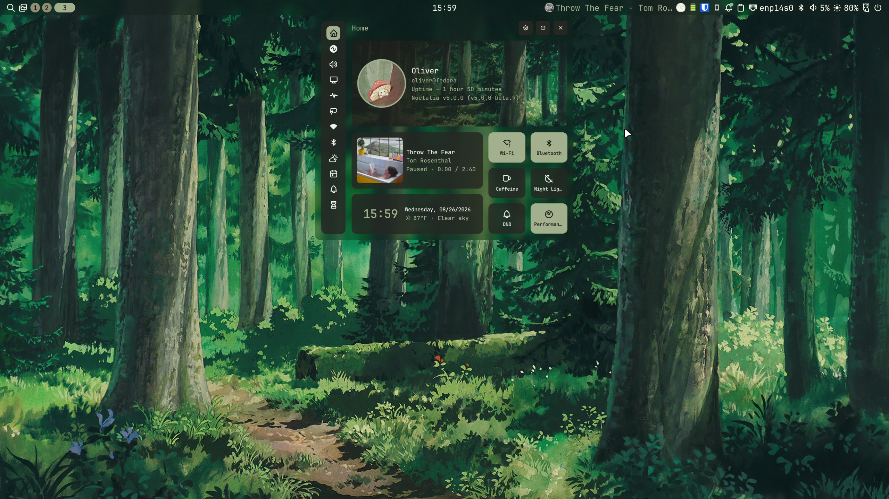
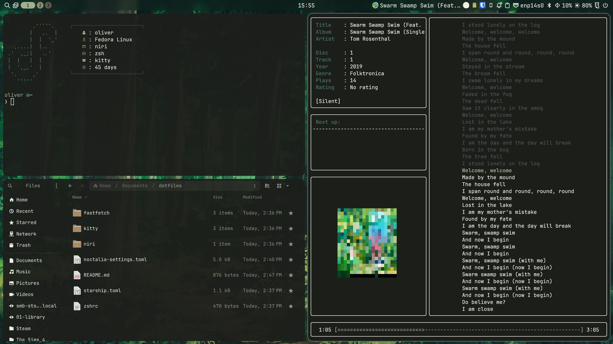

# Fedora Workstation Setup

Fedora Linux, niri, Noctalia, kitty, & zsh

## Not in this repo — install separately

Icons and cursors:
- papirus-icon-theme (dnf)
- Bibata-Modern-Ice cursor (download from GitHub releases, extract to ~/.local/share/icons/)

Fonts:
- JetBrains Mono Nerd Font
